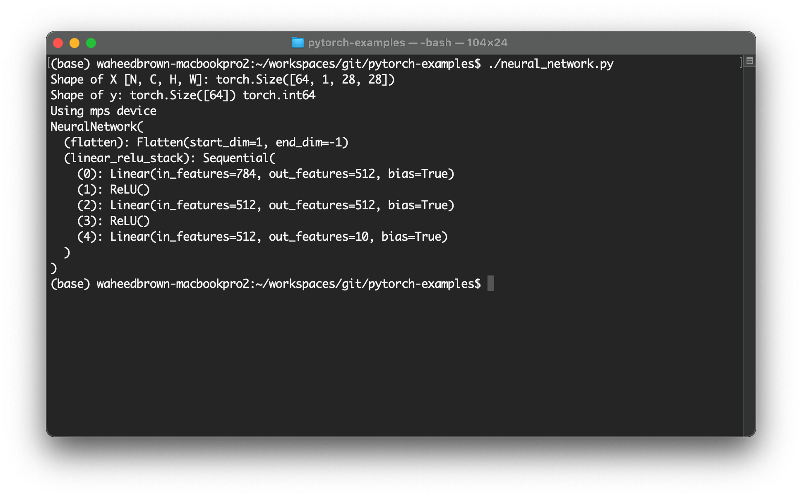
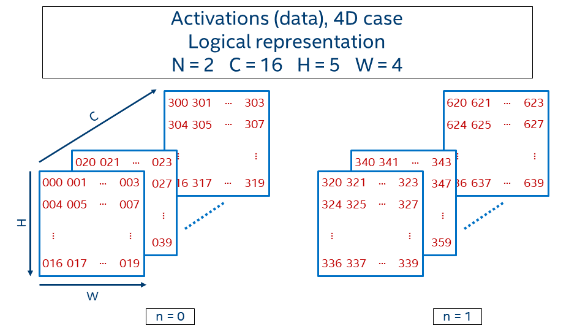

# PyTorch Examples
This repo contains examples of building, training and testing deep neural network models. The purpose is to create generative AI models locally, for use with console applications

**Deep Neural Network NCHW Memory Format**

# References
* https://pytorch.org/tutorials/beginner/basics/quickstart_tutorial.html
* [Understanding Memory Formats](https://oneapi-src.github.io/oneDNN/dev_guide_understanding_memory_formats.html)